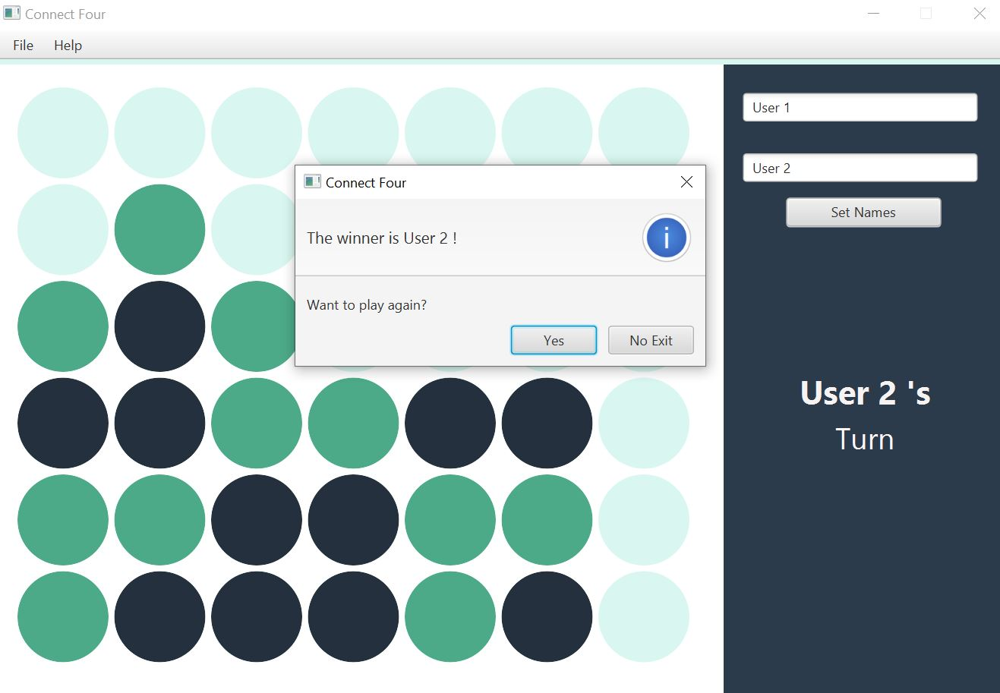

# ConnectFour
A Java based Software Application game (Connect Four Game) created with JavaFx. 

### Intial Screens

  
   
  

### During the game

### Winner

### About Connect Four
Connect Four is a two-player connection game in which each player drops colored discs from top into 7-column and 6-row suspended grid. The pieces fall straight down, occupying the next available space within the column. The first player to form a horizontal, vertical or diagonal line of four of one's own disc wins the game.

